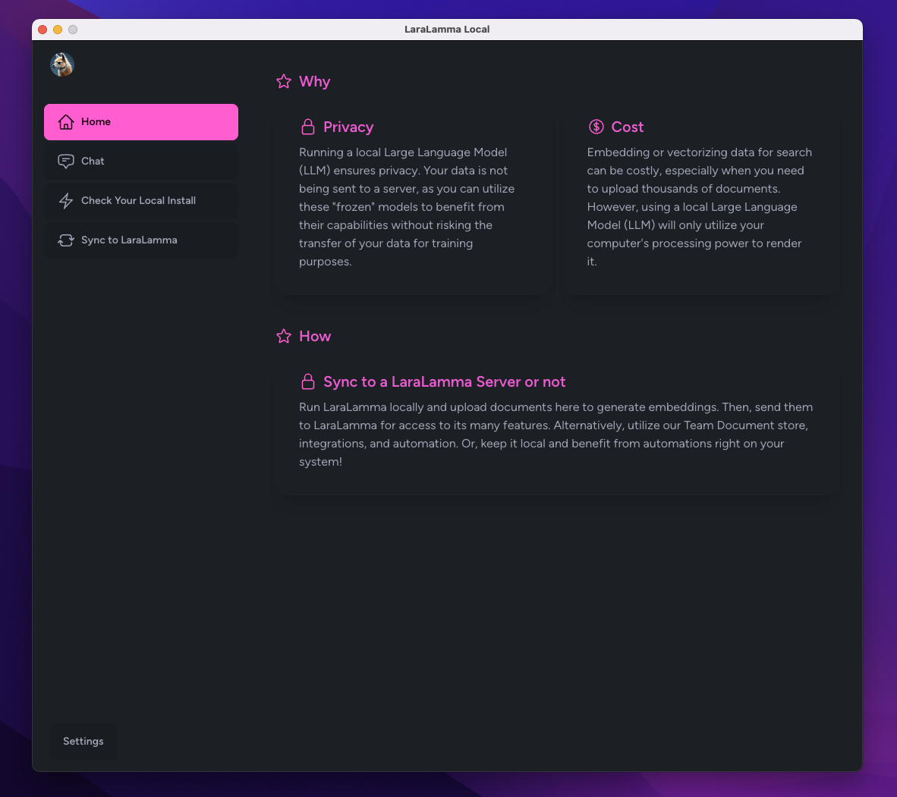

# LaraLamma Local ❤️ NativePHP

Coming soon...

## Overview

### WHY

#### Privacy

Running a local Large Language Model (LLM) ensures privacy. Your data is not being sent to a server, as you can utilize these "frozen" models to benefit from their capabilities without risking the transfer of your data for training purposes.

#### Cost
Embedding or vectorizing data for search can be costly, especially when you need to upload thousands of documents. However, using a local Large Language Model (LLM) will only utilize your computer's processing power to render it.

#### Sync to a LaraLamma Server or not

Run LaraLamma locally and upload documents here to generate embeddings. Then, send them to LaraLamma for access to its many features. Alternatively, utilize our Team Document store, integrations, and automation. Or, keep it local and benefit from automations right on your system!

## BUGS

  * The pull model timeout I need to put it on the scheduler and show the ui it is running
